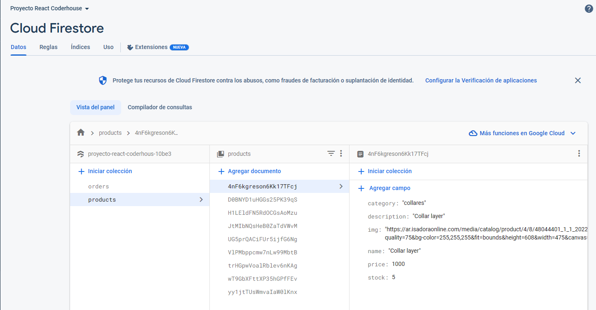
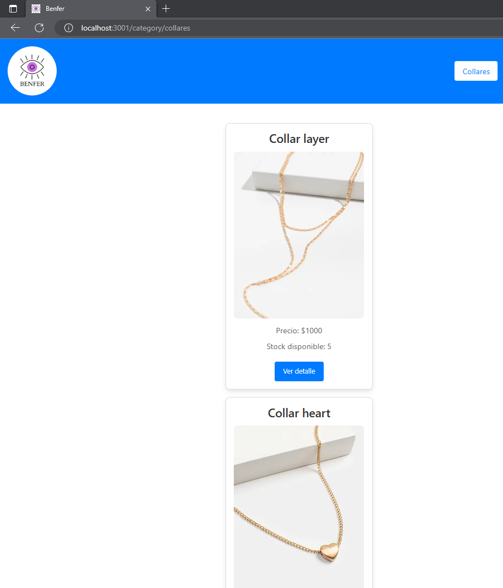
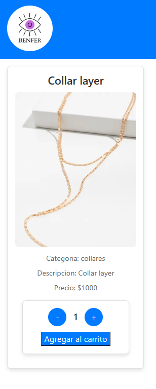
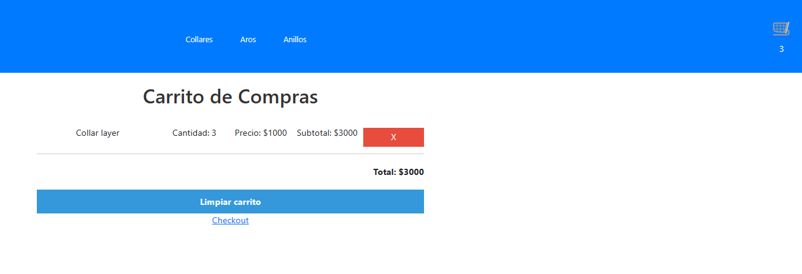
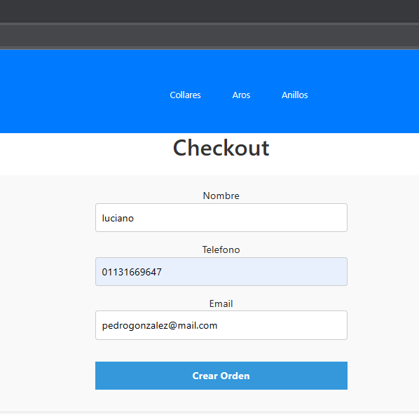
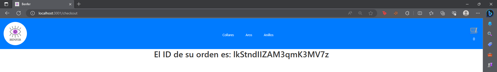
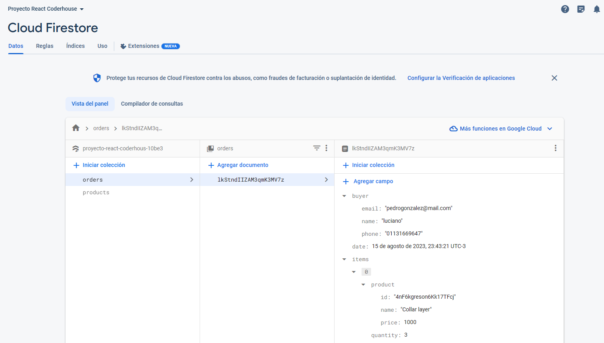

# ProyectoReact
Proyecto de React para curso de Coderhouse

## Nombre:
---
* Benzoni, Luciano David
## Proyecto: E-commerce con react
---
## Descripción
---
El proyecto consiste en la creación de un E-commerce utilizando react y la base de datos de firebase que interactua con la aplicación para cumplir ciertas funcionalidades de la pagina. También se almacena en firebase los datos de la compra como lo son los datos del usuario (nombre, telefono y email), los productos, el total y la fecha de compra.
---
---

# Funcionalidades
## 1) Productos en firebase

En la base de datos se almacenan los productos para que luego sean mostrados en la página
---
## 2)Menú principal
---

El menú principal muestra los productos traidos de la base de datos y la barra de navegación que contiene los submenús y el carrito.

## 3)Submenú (filtrado por categorías)

Los submenús al clickearlos despliega los productos pero filtrados por su categoría.
---
## 4)Detalle del producto

Al apretar en el botón ver detalle se carga una vista ampliada del producto, te deja elegir cantidad a agregar al carrito limitado por un stock.
---
## 5)Carrito

Todos los productos que se agregan mediante el botón "Agregar al carrito" son envíados al carríto,
cada vez que un producto es agregado se actualiza el contador que se encuentra debajo del logo del carríto, también al apretar sobre el icono se abre el menú donde podes ver los productos agregados, la cantidad, el precio unitario, el subtotal y el total. También hay un botón para borrar todo el carrito o ir al checkout.
---
## 6)Formulario

Una vez pasado al checkout se abre un formulario obligatorio que luego va a ser subido a la base de datos junto con la información de la compra.
---
## 7)ID Orden

Luego de completar el formulario se envía a la base de datos los datos del usuario, los productos comprados, la cantidad y el total. A cada orden se le asigna un ID que es mostrado en pantalla.
---
## 8)Ordenes en firebase

Aqui podemos ver como recibimos las ordenes en nuestra base de datos.
---
